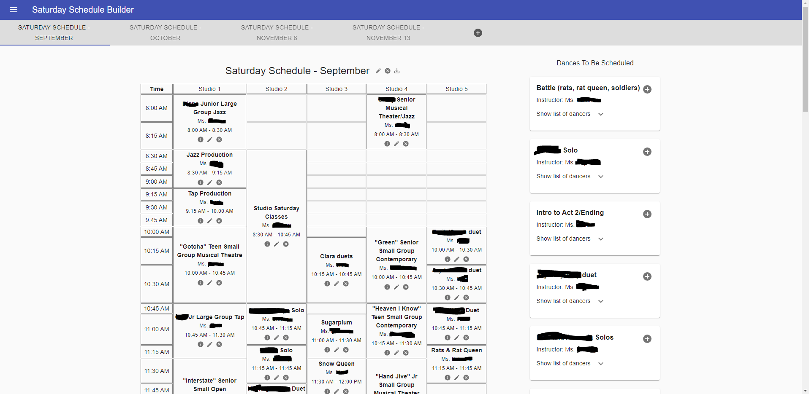
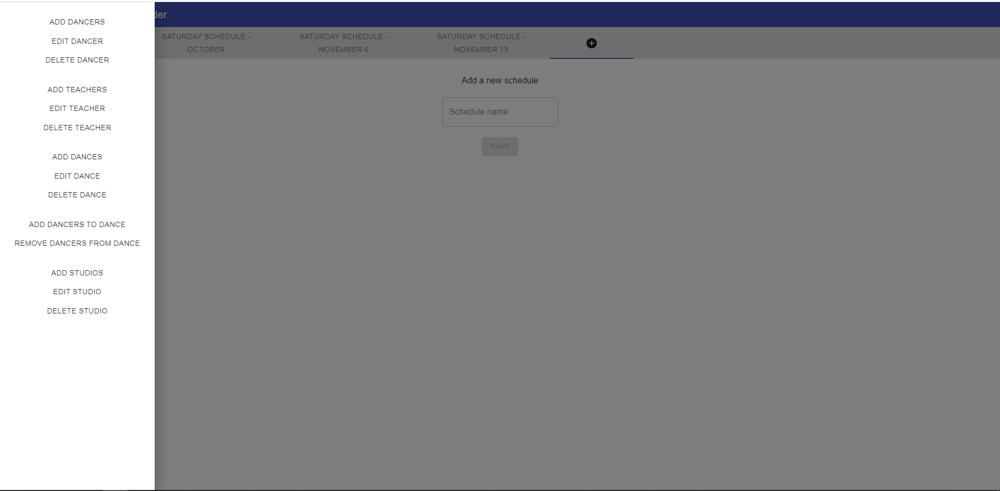
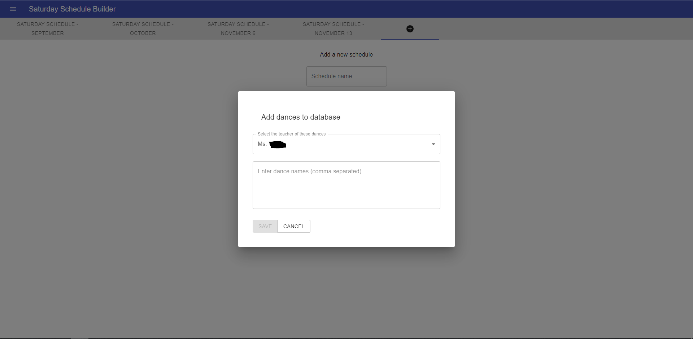
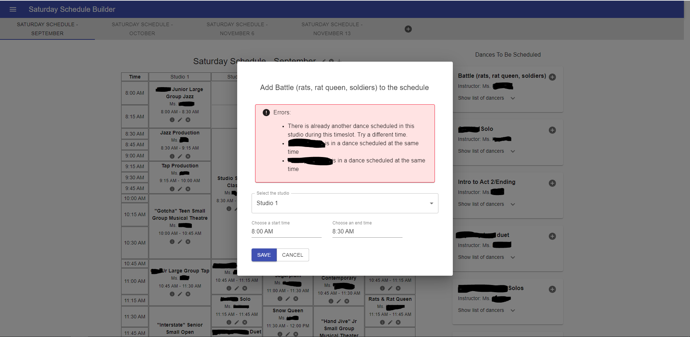

# Schedule Builder

This application was built for personal use to solve the problem of building a dance rehearsal schedule for a studio with multiple rehearsal rooms, multiple teachers, and multiple dances being rehearsed concurrently during one day. The goal was to be able to build a schedule where no one was double-booked in overlapping rehearsals. Previously, the studio used a Word document to build their rehearsal schedule, and as I'm sure you can imagine, this led to many instances of dancers being double-booked.

The application is built to be configurable -- that is, the specifics of the studio that I used it for are not hard-coded into the application. However, it does still operate on some assumptions about dance studios that makes it less applicable to other types of businesses.

## Screenshots

The application is hosted on Heroku, but due to the personal nature of the data in it, a general-purpose login is not available at this time. Here are some screenshots instead (with personally identifiable data redacted).

Schedule-building page

Admin menu and new schedule empty state

Example of an admin action modal

Example of a scheduling validation error

## Stack

- React frontend
- NodeJS backend
- Postgres DB with Sequelize
- Okta for authentication

## Setup

To run this locally, you'll need to install a SQL client (I used Postgres). You'll also need to have an Okta account set up.

After you pull down the project and install both the client and server packages, you'll need to create a `/server/.env` file with the following values:

- `DATABASE_URL={your database URL here; check Sequelize's docs for structure}`
- `OKTA_CLIENT_SECRET={Okta will provide this}`
- `APP_SECRET={Okta will provide this}`
- `OKTA_TOKEN={Okta will provide this}`
- `OKTA_ORG_URL={Okta will provide this}`

You'll also need to create a `/client/.env` file with the following values:

- `REACT_APP_OKTA_ORG_URL={Okta will provide this; it's the same as the OKTA_ORG_URL from the server file}`
- `REACT_APP_OKTA_CLIENT_ID={Okta will provide this}`

Then, you can run `npm run start` in the `/server` folder and in the `/client` folder.

To access the database via a tool like pgAdmin 4, you'll need to utilize the information you added to the `DATABASE_URL`. Postgres runs on port 5432.

## Login

To actually log into the application, you'll need to set up an account in Okta. The Schedule Builder application does not allow you to create an account, so you'll need to set it up in Okta first and then use that to login.

## Future Development

This application was built fairly quickly so that I could use it as we built rehearsal schedules. There are a lot of improvements and enhancements that I'd like to make.

Architecture:

- **Sites**: Right now, anyone who has a login will be able to see the same data. It should be that each login is associated with a site so that multiple dance studios can use the program without seeing each other's data.
- **Create logins in the application**: The application does not allow you to create an acount from within it, so everything has to be set up in Okta first. Users should be able to get a login for their respective site without someone setting it up in Okta first.

Code:

- **Unit tests**: The code really should have some unit tests.

Server:

- **Error handling**: The error messages and handling from the server are not really standardized or useful.

UI:

- **Empty states**: This app doesn't have great empty states, so those could be improved.
- **Styling**: The app is using MUI's defaults, so giving it its own design would make it feel less like a basic out-of-the-box solution.
- **Schedule tabs**: If there are a lot of schedules created, the tabs are not scrollable, and become unusable on mobile. The tabs should also be able to be reordered.
- **Double-booked warnings**: If a dance's cast is adjusted after the dance has been scheduled, the application does not re-validate that the existing schedule contains no double-bookings. To some extent this is designed behavior, as past/expired schedules should not prevent a cast list from changing. Perhaps affected dances should display in the schedule with a warning icon that the cast list has changed and may now contain conflicts, and if they want to, the user is able to re-run validation.
- **In-app guide**: The application can be confusing to use for the first time, so new users should have access to a guide that explains how to use the application.
- **Redirect if already logged in**: If the user is already logged in, they currently see the option to logout. The application should redirect them to `/protected` so they can use the app.
